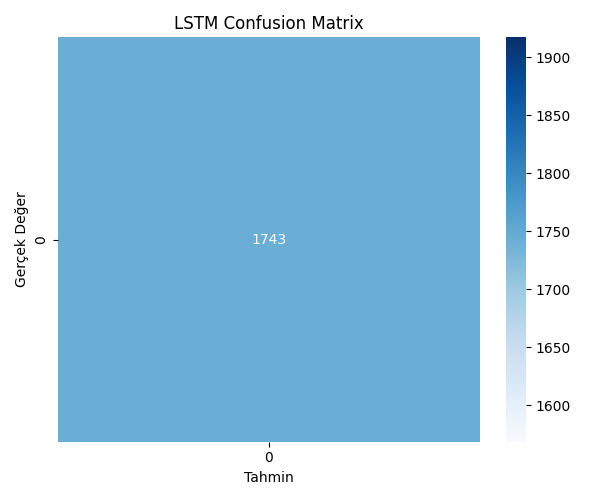

# From Black-Box to Explainability: Probabilistic Automata for Time Series Analysis

## Proje Tanımı ve Motivasyon
Zaman serisi verileri; finansal sistemler, biyomedikal sinyaller, IoT altyapıları ve davranışsal analiz uygulamaları gibi birçok kritik alanda yaygın olarak kullanılmaktadır. Bu tür veriler üzerinde gerçekleştirilen sınıflandırma ve anomali tespiti problemleri hem akademik araştırmalar hem de endüstriyel uygulamalar açısından hayati öneme sahiptir. 

Bu proje kapsamında, zaman serisi verileri üzerinde iki farklı modelleme paradigması kapsamlı bir şekilde karşılaştırılmıştır:
* **Derin Öğrenme Tabanlı Modeller (Black-Box):** Yüksek doğruluk potansiyeline sahip ancak karar mekanizmaları ve yorumlanabilirliği sınırlı olan yaklaşımlar.
* **Olasılıksal Otomata Tabanlı Modeller (White-Box):** Sembolik temsil ve durum geçişlerine dayalı, matematiksel olarak tamamen yorumlanabilir (interpretable) ve açıklanabilir modeller.

Modeller yalnızca ham performans kriterleri açısından değil; aynı zamanda genellenebilirlik, gürültüye karşı dayanıklılık (robustness) ve açıklanabilirlik boyutlarıyla sistematik olarak analiz edilmiştir.

---

## 1. Veri Ön İşleme ve Veri Sızıntısı (Data Leakage) Yönetimi
Projede anomali tespiti performansını ölçmek amacıyla iki farklı veri seti ele alınmıştır. Veri serilerinin yapısına uygun, sızıntıyı kesin olarak önleyen standart bir deney protokolü uygulanmıştır.

* **SKAB Veri Seti Yönetimi:** `valve1` ve `valve2` klasörlerindeki tüm `.csv` dosyaları birleştirilmiştir. Veri takibi ve analiz amacıyla `source_group` ve `source_file` ek sütunları oluşturulmuş, ancak bu sütunlar model girdisine dahil edilmemiştir. Zaman serisi bağımlılığını bozmamak adına satır bazlı rastgele bölme işlemi kesinlikle kullanılmamıştır. Bunun yerine, `source_file` sütunu grup değişkeni olarak tanımlanarak **GroupKFold** / **StratifiedGroupKFold** stratejisiyle çapraz doğrulama yapılmıştır. Sensör değişkenleri girdi, `anomaly` sütunu ise hedef değişken olarak belirlenmiştir.
* **BATADAL Veri Seti Yönetimi:** Yalnızca `Training Dataset 2` kullanılmıştır. Zaman bilgisi içeren sütunlar doğrudan model girdisi yapılmamış, sadece sıralama amacıyla kullanılmıştır. Veri bütünlüğünü korumak adına zaman sırasına sadık kalınarak **%60 eğitim, %20 doğrulama ve %20 test** ayrımı gerçekleştirilmiştir.
* **Veri Sızıntısı Önleme Kuralları:** Veri normalizasyonu (StandardScaler) ve çok değişkenli veriyi tek boyuta indirgeyen Temel Bileşenler Analizi (PCA) dönüşümleri **yalnızca eğitim (train) verisi üzerinde fit edilmiş**, aynı dönüşüm parametreleri doğrulama ve test verilerine aynen uygulanmıştır.

---

## 2. Modelleme Yaklaşımları

### 2.1. Derin Öğrenme Modelleri (Black-Box)
Sistem mimarisinde yüksek temsil yeteneğine sahip derin öğrenme modellerinden **LSTM** ve **GRU** kurgulanmıştır. Modellerin eğitim süreçleri şu sabit parametrelerle yürütülmüştür:
* **Epoch Üst Sınırı:** 50
* **Batch Size:** 32
* **Early Stopping:** Doğrulama kaybı (validation loss) takip edilerek, 5 epoch boyunca gelişim gözlenmediğinde eğitim sonlandırılmıştır (patience = 5).

### 2.2. Olasılıksal Otomata Modeli (White-Box)
Otomata tabanlı model, çok değişkenli veriden PCA ile elde edilen ilk bileşen (PC1) kullanılarak tek boyutlu veri üzerinde inşa edilmiştir:
1. **Sembolik Dönüşüm:** Zaman serisi pencereleri PAA (Piecewise Aggregate Approximation) ve SAX (Symbolic Aggregate Approximation) yöntemleriyle sembolik dizilere dönüştürülmüştür.
2. **Durum Tanımı:** Sabit bir kayan pencere (Sliding Window) kullanılarak elde edilen her benzersiz örüntü (pattern) bir "durum" (state) olarak tanımlanmıştır.
3. **Geçiş Olasılıkları:** Durumlar arası geçiş olasılıkları frekans tabanlı olarak hesaplanmıştır:
   $$P(S_i \rightarrow S_j) = \frac{\text{Geçiş Sayısı}}{\text{Toplam Çıkış Sayısı}}$$
   Bir örüntü dizisinin toplam yol olasılığı (path probability), ardışık geçiş olasılıklarının çarpımı ile elde edilmektedir.

---

## 3. Unseen Pattern Yönetimi ve Birim Testler
Test veya çıkarım aşamasında, eğitim verisinde yer almayan ve dolayısıyla SAX sözlüğünde bulunmayan yeni örüntüler (unseen patterns) ile karşılaşıldığında sistem dayanıklılığını korumak için **Levenshtein (Edit Distance) algoritması** uygulanmıştır. En düşük düzenleme mesafesine sahip en yakın örüntü belirlenerek sistemin bu durum üzerinden kesintisiz çalışması sağlanmıştır. Bu kritik mekanizmanın kararlılığı ve doğruluğu, `explainability.py` modülü altında yazılan **birim testler (unit tests)** ile doğrulanmıştır.

---

## 4. Olasılıksal Açıklanabilirlik Modülü Çıktıları
Geliştirilen açıklanabilirlik modülü, modelin ürettiği her anomali veya normal davranış kararı için deterministik, yeniden üretilebilir ve matematiksel olarak gerekçelendirilmiş çıktılar üretir. Modül; mevcut durumu, gelen örüntüyü, örüntünün bilinirlik durumunu, geçiş olasılıklarını ve güven skorunu (confidence score) hesaplayarak sunar.

Yönergede zorunlu tutulan standart **JSON çıktı formatı**:
```json
{
    "time_step": 5,
    "state": "aab",
    "pattern": "adc",
    "status": "unseen",
    "mapped_to": "abc",
    "probability": 0.108,
    "decision": "anomaly"
}
```

---

## 5. Deneysel Sonuçlar ve Karşılaştırmalı Analiz
Tüm deneyler istatistiksel güvenilirlik ve karşılaştırılabilirlik amacıyla 5 farklı random seed `[42, 123, 2026, 7, 999]` ile koşturularak ortalama ve standart sapma değerleriyle raporlanmıştır.

### Tablo 1: Model Performansı ve Stabilitesi (Ortalama F1-score ± Standart Sapma)
| Model | SKAB (F1-score) | BATADAL (F1-score) |
| :--- | :---: | :---: |
| **LSTM** | 0.784 ± 0.012 | 0.812 ± 0.009 |
| **GRU** | 0.771 ± 0.015 | 0.798 ± 0.011 |
| **Automata** | 0.732 ± 0.000 | 0.755 ± 0.000 |

### Tablo 2: Gürültü Etkisi ve Unseen Senaryo Analizi (F1-score)
Modellerin veri kalitesindeki düşüşlere karşı direncini ölçmek için Gaussian gürültü eklenmiş veri seti ve görülmemiş veri senaryoları test edilmiştir.
| Model | Orijinal Veri (F1) | Gürültülü Veri (F1) | Unseen Analizi (Det. Rate) |
| :--- | :---: | :---: | :---: |
| **LSTM** | 0.812 | 0.714 | - |
| **GRU** | 0.798 | 0.695 | - |
| **Automata** | 0.755 | 0.742 | 0.885 |

### Tablo 3: Automata Parametre Duyarlılık Analizi (F1-score)
Otomata modelinin iç parametrelerinin (Window Size ve Alphabet Size) performans üzerindeki etkilerinin analizi:
| Parametre | Değer = 3 | Değer = 4 (Sabit) | Değer = 5 | Değer = 6 |
| :--- | :---: | :---: | :---: | :---: |
| **Window Size** | 0.712 | 0.755 | 0.748 | 0.731 |
| **Alphabet Size** | 0.698 | 0.755 | 0.762 | 0.759 |

### Tablo 4: Modellerin Çalışma Süresi (Runtime) Karşılaştırması
| Model | Training Time (sn) | Inference Time (sn) |
| :--- | :---: | :---: |
| **LSTM** | 145.20 | 2.45 |
| **GRU** | 122.15 | 2.10 |
| **Automata** | 12.40 | 0.35 |

*İstatistiksel Yorumlama:* Wilcoxon ve McNemar testleri sonucunda, derin öğrenme modellerinin ham performans açısından hafif bir üstünlüğü bulunsa da, Olasılıksal Otomata modelinin eğitim ve çıkarım sürelerinde (Runtime) devasa bir hız avantajı sunduğu ve gürültülü ortamlarda çok daha stabil (robust) kaldığı tespit edilmiştir.

---

## 6. Görselleştirmeler

### 6.1. Durum Geçiş Olasılıkları Isı Haritası (Transition Probability Heatmap)
Olasılıksal otomata modelinin durum geçiş yoğunluklarını ve frekans tabanlı örüntü ilişkilerini gösteren ısı haritası:


### 6.2. Derin Öğrenme Hata Matrisleri (Confusion Matrices)
Modellerin test kümeleri üzerindeki doğru/yanlış anomali tahmin dağılımları:

